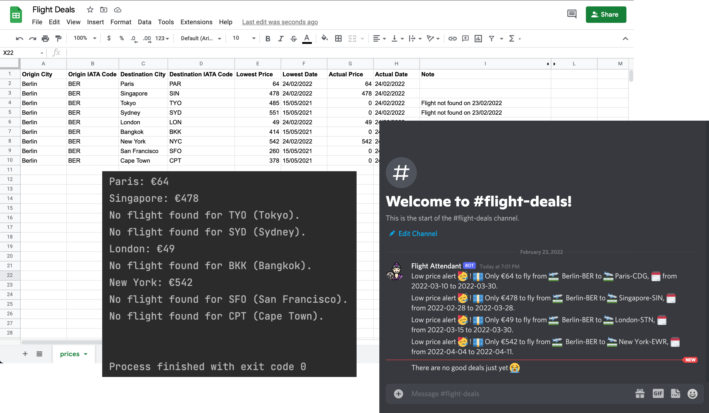
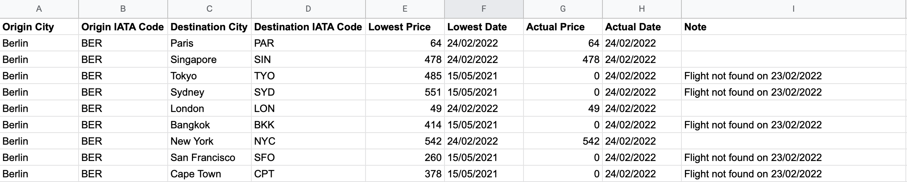

# Flight Deals

<!-- TABLE OF CONTENTS -->

  
Table of Contents

  <ol>
    <li>
      <a href="#about-the-project">About the Project</a>
    </li>
    <li><a href="#features">Futures</a></li>
    <li><a href="#howto">How to set up</a></li>
    <li><a href="#license">License</a></li>
  </ol>

<!-- ABOUT THE PROJECT -->
## About the Project

Flight deals is an automated flight price search and notification program. It’s designed to be run by a task 
manager to check flight prices on (at least) a daily basis. The program was inspired by my price tracking websites. 
Nowadays, there a quite a lot of deals checkers. In order to use them, you have to register with your email to get a 
price notification, mostly on a daily basis. This code can be run on l local computer or be deployed on a task-managing 
website. It’s enough to run it once a day.

I got a quite satisfactory result when running the code with 9 destinations. The computational cycles only last a 
few seconds. On my slowest computer, it took only about 30 seconds to finish the process. It might be faster or 
slower also depending on how fast the data can be retrieved from API calls.

I recently made a few updates to allow the program to run more flexibly. Once the could is deployed, you can change 
the destination on a google sheet. In order to successfully retrieve the right data, you must spell the destination 
name (City) and IATA Code correctly. It is no need to make any changes to the code.

**Repository:** [Flight Deals](https://github.com/drliptons/flight-deals)

(<a href="#top">back to top</a>)

<!-- FEATURES -->
## Features
___
* Getting latest flight deals
* Compare latest deals with expected/previous prices
* Save all the flight data to a google sheet on google drive
* Send a discord message when a deal or no is found
* Send an error message when an error occurred between the process

(<a href="#top">back to top</a>)

<!-- HOWTO -->
## How to set up
___
1. Setup a google sheet as the template below: 
* `Origin City`: Full name of the origin city
* `Origin IATA`: IATA code of the origin airport. It is IMPORTANT to correctly spell the city’s IATA code
* `Destination City`: Full name of the destination city
* `Destination IATA Code`: IATA code of the destination airport. It is IMPORTANT to correctly spell the city’s IATA code
* `Lowest Price`: Lowest price since running the program. In the initial run please enter your expected price. This cell will be replaced with a lower price in the future
* `Lowest Date`: Date of the lowest price detected
* `Actual Price`: Current price as of running the program
* `Actual Date`: Current date as of running the program
* `Note`: Algorithm note automatic generated by the code

1. Fill all the information in the `service_account.json` file.
Personal data from kiwi API:
    * `type`: type of the API
    * `project_id`: your project id
    * `private_key_id`: your personal key id of the current project
    * `private_key`: your personal key of the current project
    * `client_email`: personal client email
    * `client_id`: your personal client id
Google API
    * `auth_uri`: authentication uri
    * `token_uri`: authentication token uri
    * `auth_provider_x509_cert_url`: api provider
    * `client_x509_cert_url`: api url
1. Fill all the data in `account_file.json`
Google sheet data
    * `spread_sheet_id`: the id of the google spreadsheet
    * `spreadsheet_range`: range of the data on the google spread sheet. Ex: prices!A1:I10 `SHEET_NAME` + `!` + `FIRST_CELL` + `LAST_CELL`
    * `sheet_name`: name of the sheet
    * `default_origin_city`: full name of the origin city
    * `default_origin_IATA_code`: IATA code of the origin city
Kiwi API
    * `tq_endpoint`: kiwi API endpoint
    * `tq_api_key`: kiwi API key
Discord webhook
    * `discord_webhook_stock`: discord webhook URL of the respective chat
1. Run `main.py`
2. The search result will be sent to your discord server with the following data;
    * `verification alert`: if a city IATA code is not correct a price search for that city can’t begin.
    * `lowest price`: will be sent only if the new price is lower than the current listed lowest price

(<a href="#top">back to top</a>)

<!-- LICENSE -->
## License
___
Distributed under the MIT License. Please see `LICENSE.md`
for further information

(<a href="#top">back to top</a>)

